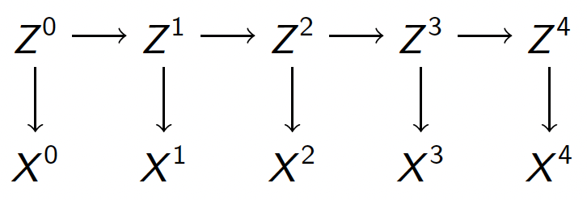

``` {r}
library(HMM)
library(entropy)
```

## 1

We can model the observed reading from the sensor at time $t$ as $X^t$, and the latent position of the robot at time $t$ as $Z^t$. Per the problem description:

* Sample space of both $X^t$ and $Z^t$ is $\{0, 1, 2, ..., 9\}$
* $X^t | Z^t = i \sim DiscreteUnif([(i-2) ~mod ~10, (i+2) ~ mod ~10])$
* $Z^{t+1} | Z^t = i \sim DiscreteUnif({i, (i+1) ~mod ~10})$

This yields the following graphical model:

{width=50%}

## 2

Requested simulation was performed using two methods; results plotted below.

### Method 1: Only Base R functions used
``` {r, fig.asp = 0.8}

Z <- vector("numeric", 100)
X <- vector("numeric", 100)

# seed
Z[1] = sample(1:10, 1)

# start simulation

X[1] = sample(c((Z[1]-2) %% 10, (Z[1]-1) %% 10, Z[1], (Z[1]+1) %% 10, (Z[1]+2) %% 10), 1)

for (i in 2:100) {
  
  Z[i] = sample(c(Z[i - 1], (Z[i - 1] + 1) %% 10), 1)
  X[i] = sample(c((Z[i]-2) %% 10, (Z[i]-1) %% 10, 
                  Z[i], (Z[i]+1) %% 10, (Z[i]+2) %% 10), 1)
  
}

# plot results
plot(1:100, Z, type = 'l', xlab = "Time Step", 
     ylab = "Simulated Value of Z (Black) and X (Red)", 
     main = "Results of Simulation for 100 Time Steps",
     ylim = c(0, 9))
lines(1:100, X, col = 'red')
```

### Method 2: HMM Package used
``` {r, fig.asp = 0.8}
robot_hmm <- initHMM(States = as.character(0:9), Symbols = as.character(0:9), 
               startProbs = rep(0.1, 10),
               transProbs = diag(0.5, 10) + diag(0.5, 10)[, c(10, 1:9)],
               emissionProbs = t(diag(0.2, 10)[, c(9:10, 1:8)]) +
                 t(diag(0.2, 10)[, c(10, 1:9)]) + diag(0.2, 10) + 
                 diag(0.2, 10)[, c(10, 1:9)] + diag(0.2, 10)[, c(9:10, 1:8)])

# simulation
sim <- simHMM(robot_hmm, 100)

# plot results
plot(1:100, sim$states, type = 'l', xlab = "Time Step", 
     ylab = "Simulated Value of Z (Black) and X (Red)", 
     main = "Results of Simulation for 100 Time Steps",
     ylim = c(0, 9))
lines(1:100, sim$observation, col = 'red')

```

## 3

As asked, the simulated observations (of sensor readings) were used to compute the filtered and smoothed probability distributions for each of the 100 time points. The most probable path was also computed. Workings below.

The smoothed and filtered distributions were computed using the following formulae:

* Smoothed: $p(z_t | x^{0:T})=\frac{\alpha(z^{t})\beta(z^{t})}{\sum_{z^{t}}\alpha(z^{t})\beta(z^{t})}$,
* Filtered: $p(z_t | x^{0:t})=\frac{\alpha(z^{t})}{\sum_{z^{t}}\alpha(z^{t})}$,

where $\alpha(z^{t})$ and $\beta(z^{t})$ were computed using the Forward-Backward algorithm.

The most probable path was obtained using the Viterbi algorithm.

``` {r}
forward_probs <- exp(forward(robot_hmm, as.character(X)))
backward_probs <- exp(backward(robot_hmm, as.character(X)))
product_probs <- forward_probs*backward_probs

filtered <- sapply(1:100, function(i) 
  forward_probs[, i]/sum(forward_probs[, i]))
smoothed <- sapply(1:100, function(i)
  product_probs[, i]/sum(product_probs[, i]))

most_probable_path <- viterbi(robot_hmm, as.character(X))
```

## 4

The requested accuracy measures have been computed as shown below.

``` {r}
filtered_most_probable_path <- apply(filtered, 2, which.max) - 1
smoothed_most_probable_path <- apply(smoothed, 2, which.max) - 1

print(paste0("Accuracy of the most probable states ",
            "using the filtered distribution was ",
            sum(filtered_most_probable_path == Z), "%"))

print(paste0("Accuracy of the most probable states ",
            "using the smoothed distribution was ",
            sum(smoothed_most_probable_path == Z), "%"))

print(paste0("Accuracy of the most probable states ",
            "as obtained through the Viterbi algorithm was ",
            sum(most_probable_path == Z), "%"))
```

## 5

In 100 simulations, the 'most probable paths' estimated using the smoothed distributions ('smoothed paths') yielded better accuracy than those estimated using both the filtered distributions ('filtered paths') and the Viterbi algorithm ('Viterbi paths') almost always (see graph below).

### Filtered vs. Smoothed Paths
From the graphical model shown in Q(1), we can see that 'future' observed states (sensor readings) can be meaningful in estimating the 'current' hidden state (actual robot position). This is because at any given time $t$, there are open paths from 'future' states (i.e. $X^{t+1}, ~i \in \{1, 2, 3, ..\}$) to $Z^t$ and the causal nature of the graph implies known dependencies between the 'current' hidden state and all available observed states, 'past', 'present', and 'future'.

Between the methods using Smoothed and Filtered distributions, only the one using Smoothed distributions considers all available observations to estimate the 'current' hidden state. The same can therefore possibly be expected to yield better accuracy than the other.

### Viterbi vs. Smoothed Paths
Whereas a Viterbi path is that sequence of hidden states which jointly has the highest conditional likelihood amongst all such sequences (given the observed states), a Smoothed paths is a sequence of hidden states each of which individually has the highest conditional likelihood amongst all hidden states (given the observed states).

Thus, Smoothed paths may at times include state transitions which are illegal according to the model specifications. However, since they are constructed as mentioned above, Viterbi paths will never include illegal state transitions. As it happens in this case, Smoothed paths do have higher accuracy than Viterbi paths.

``` {r, fig.asp = 0.8}
filtered_acc <- vector("numeric", 100)
smoothed_acc <- vector("numeric", 100)
viterbi_acc <- vector("numeric", 100)

for (i in 1:100) {
  
  sim <- simHMM(robot_hmm, 100)
  forward_probs <- exp(forward(robot_hmm, sim$observation))
  backward_probs <- exp(backward(robot_hmm, sim$observation))
  product_probs <- forward_probs*backward_probs
  
  filtered <- sapply(1:100, function(i) 
    forward_probs[, i]/sum(forward_probs[, i]))
  smoothed <- sapply(1:100, function(i)
    product_probs[, i]/sum(product_probs[, i]))
  
  filtered_most_probable_path <- apply(filtered, 2, which.max) - 1
  smoothed_most_probable_path <- apply(smoothed, 2, which.max) - 1
  most_probable_path <- viterbi(robot_hmm, sim$observation)
  
  filtered_acc[i] <- sum(filtered_most_probable_path == sim$states)
  smoothed_acc[i] <- sum(smoothed_most_probable_path == sim$states)
  viterbi_acc[i] <- sum(most_probable_path == sim$states)
  
}

plot(1:100, filtered_acc, type = 'l', col = 'red', 
     ylim = c(min(filtered_acc, smoothed_acc, viterbi_acc), 95),
     xlab = "Simulation Index", ylab = "Accuracy Observed",
     main = "Accuracy of the three methods in 100 simulationss")
lines(1:100, smoothed_acc, col = 'green')
lines(1:100, viterbi_acc, col = 'blue')
legend(1, 95, col = c('red', 'green', 'blue'),
       legend = c('Filtered', 'Smoothed', 'Viterbi'), lty = 1, cex = 0.7)

```

## 6

For this question, we start by using results from the last simulation in Q(5). Also since the question refers to where the robot _is_, we concern ourselves with the filtered distribution alone.

We see no evidence of decrease in the (conditional) entropy of hidden states ($Z^t | X^{0:T}$) as we collect more data (over time) -- see graph below. (NB: each Multinoulli distribution $Z^t | X^{0:T}$ was estimated as the 'Filtered' distribution)

Since the assertion has already been disproved with one simulation, we don't perform more simulations.

``` {r, fig.asp = 0.8}
# entropy over time
plot(1:100, apply(filtered, 2, entropy.empirical),
     ylab = "Conditional Entropy", xlab = "Time",
     main = "Conditional Entropy of the Hidden States", type = 'l')

```

## 7

For this question, we once again consider the results from the last simulation in Q(5).

$$p(z^{100}|x^{0:99}) = \sum_{z^{99}}p(z^{100}, z^{99}|x^{0:99}) = \sum_{z^{99}}p(z^{100}|z^{99},x^{0:99})p(z^{99}|x^{0:99})$$

From the graph, we can observe that $Z^{99}$ separates $Z^{100}$ from $X^{0:99}$. Thus, $p(z^{100}|z^{99},x^{0:99}) = p(z^{100}|z^{99})$, which is given by the transition probability matrix.

Also, $p(z^{99}|x^{0:99})$ is the filtered distribution of $Z^{99}$.

Thus the conditional distribution of $Z^{100}|X^{0:99}$ is given by the product of the filtered distribution at time 100 and the transition probability matrix.

``` {r}
print(filtered[, 100] %*% robot_hmm$transProbs)
```